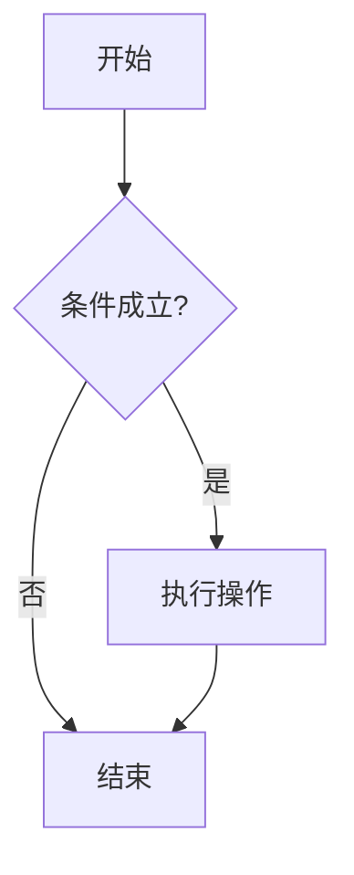

这是第一篇随笔，用来演示效果。把 `.md` 文件放进 `src/posts/` 文件夹，网站就会自动读取并展示。

## 关于 Markdown

支持标准的 Markdown 语法，包括**加粗**、*斜体*、`行内代码`、[链接](https://www.ustc.edu.cn)、图片、列表等等。

## 代码高亮

```js
function greet(name) {
  return `你好，${name}！`
}
console.log(greet('Jimsss'))
```

```python
def fib(n):
    a, b = 0, 1
    for _ in range(n):
        a, b = b, a + b
    return a
```

## 列表

- 第一项
- 第二项
  - 嵌套项

## 引用

> 学而时习之，不亦说乎。

## 目录会自动生成

上面这些二级标题，都会出现在右侧的目录里。

## Mermaid 图表

用 mermaid 代码块就能画图，例如一个简单的流程图：



## 数学公式

行内公式：质能方程 $E = mc^2$，欧拉公式 $e^{i\pi} + 1 = 0$。

块级公式：

$$
\int_{-\infty}^{\infty} e^{-x^2} \, dx = \sqrt{\pi}
$$

$$
x = \frac{-b \pm \sqrt{b^2 - 4ac}}{2a}
$$
